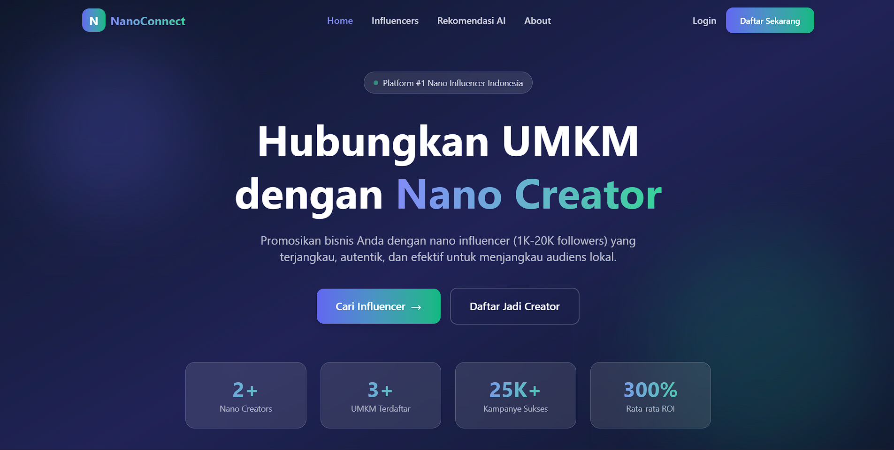

# 🚀 NanoConnect

Platform inovatif yang menghubungkan **UMKM** dengan **Nano Creator** (1K-20K followers) untuk pemasaran digital yang lebih terjangkau, autentik, dan efektif.



> **Catatan:** Program ini adalah hasil karya submisi untuk **Devhandal 2026**, sebuah program beasiswa coding dari **Codepolitan** yang berkolaborasi dengan **Tencent EdgeOne**.

---

## 🎯 Tentang Project

**NanoConnect** dibangun untuk memecahkan masalah mahalnya biaya pemasaran influencer bagi UMKM dan sulitnya nano creator mendapatkan klien.

Dengan platform ini:
- **UMKM** dapat menjangkau audiens lokal dengan budget minim namun _engagement_ tinggi.
- **Nano Creator** mendapatkan wadah untuk memonewtisasi konten sosial media mereka secara profesional.
- **Ekosistem Digital** menjadi lebih inklusif bagi pelaku bisnis kecil.

## 🛠️ Teknologi yang Digunakan

Aplikasi ini dibangun menggunakan teknologi web modern untuk performa tinggi dan skalabilitas (SEO-friendly & Edge-ready).

| Kategori | Teknologi | Deskripsi |
|----------|------------|-----------|
| **Frontend** | React 18 + Vite | UI Library modern yang cepat dan ringan |
| **Styling** | Tailwind CSS | Framework CSS utility-first untuk desain responsif & cantik |
| **Routing** | React Router v6 | Manajemen navigasi halaman SPA |
| **Database** | Supabase | Backend-as-a-Service berbasis PostgreSQL |
| **Backend** | EdgeOne Functions | Serverless computing untuk performa rendah latensi |
| **Iconography** | Heroicons | Set ikon SVG yang bersih dan modern |
| **Font** | Google Fonts (Inter) | Tipografi yang mudah dibaca |

## 🚀 Cara Install dan Menjalankan di Local

Ikuti langkah-langkah berikut untuk menjalankan project ini di komputer Anda:

### Prasyarat
- **Node.js** (versi 18 atau terbaru)
- **npm** atau **yarn**
- Akun **Supabase** (untuk database)

### Langkah-langkah

1. **Clone Repository**
   Buka terminal dan jalankan perintah:
   ```bash
   git clone https://github.com/Dunaman10/nanoconnect.git
   cd nanoconnect
   ```

2. **Install Dependencies**
   Download semua library yang dibutuhkan:
   ```bash
   npm install
   ```

3. **Konfigurasi Environment Variable**
   Duplikat file contoh konfigurasi:
   ```bash
   cp .env.example .env
   ```
   Buka file `.env` dan isi kredensial Supabase Anda:
   ```env
   VITE_SUPABASE_URL=https://your-project-id.supabase.co
   VITE_SUPABASE_ANON_KEY=your-anon-key-here
   ```

4. **Setup Database**
   - Login ke dashboard Supabase Anda.
   - Buka menu **SQL Editor**.
   - Copy isi file `nanoconnect_database.sql` yang ada di root folder project ini.
   - Paste dan jalankan (Run) query tersebut untuk membuat tabel yang dibutuhkan.

5. **Jalankan Development Server**
   ```bash
   npm run dev
   ```
   Buka browser dan akses alamat yang muncul (biasanya `http://localhost:5173`).

## ✨ Fitur Unggulan

- **Smart Matching Engine**: Mencocokkan UMKM dengan influencer berdasarkan niche dan budget secara otomatis.
- **Real-time Analytics**: Dashboard untuk memantau performa kampanye (Reach, Engagement, ROI).
- **Secure Escrow Payment**: Sistem pembayaran yang menahan dana hingga pekerjaan selesai untuk keamanan kedua belah pihak.
- **Chat System**: Fitur pesan instan untuk negosiasi langsung antara UMKM dan Creator.
- **Edge Computing**: Komputasi di _edge_ menggunakan Tencent EdgeOne untuk respon aplikasi yang super cepat.

---

<p align="center">
  Dibuat dengan ❤️ untuk kemajuan UMKM Indonesia
  <br>
  © 2026 NanoConnect
</p>
